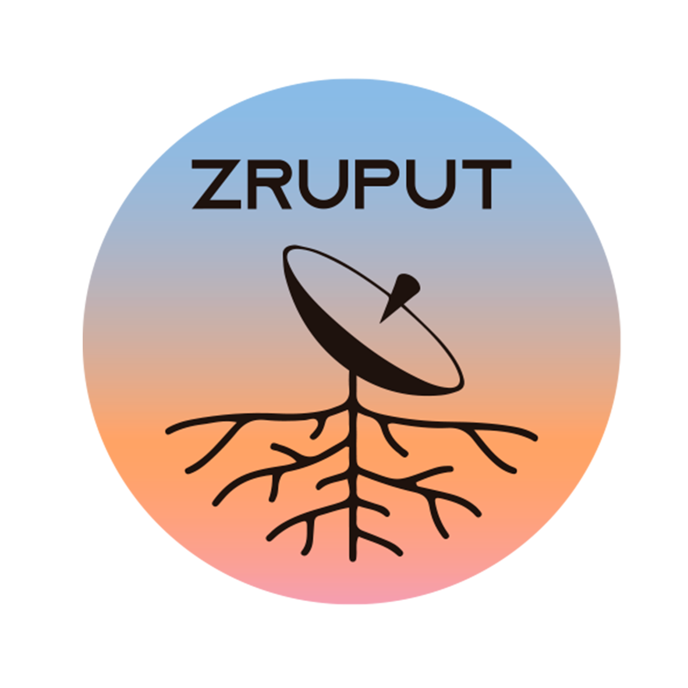
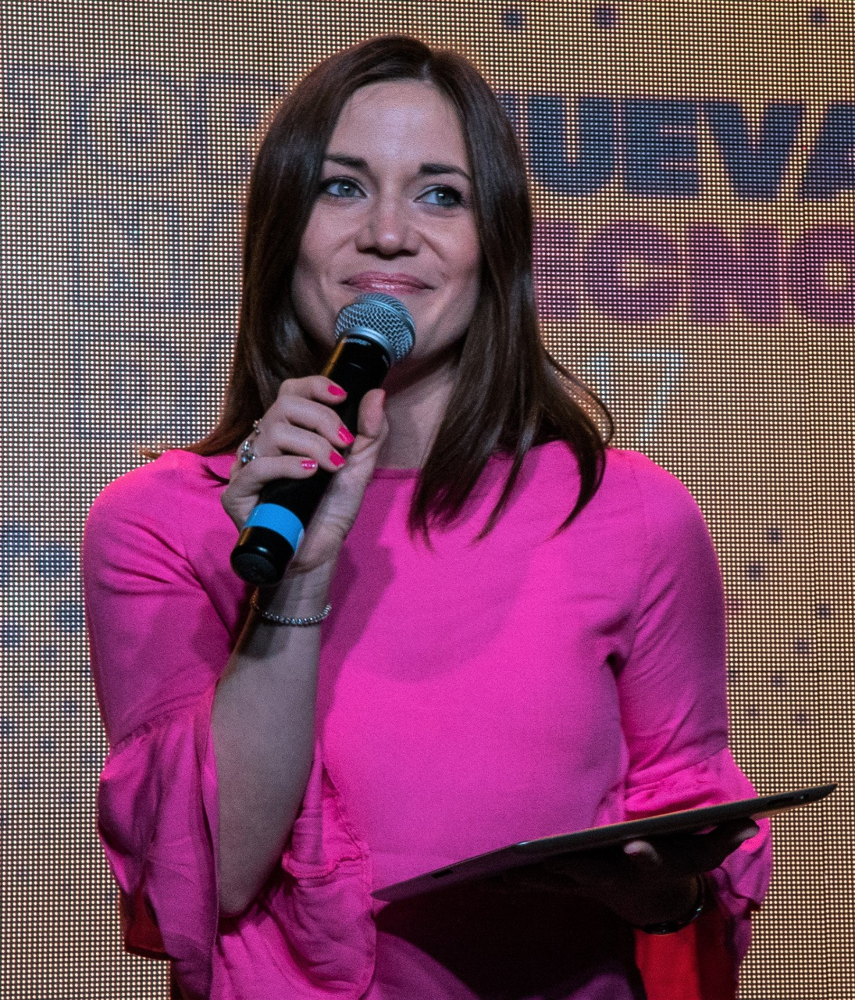

# Zruput

Zruput es una conferencia de Comunicaciones Digitales.

Su primera edición tendrá lugar el viernes 14 de Junio en [CCKonex](https://www.cckonex.org/), Buenos Aires, Argentina.

Las entradas están a la venta en [eventbrite](https://www.eventbrite.com.ar/e/zruput-tickets-57829836598).

## Propósito

Las nuevas exigencias sobre las telecomunicaciones que la sociedad ha alcanzado
y el desarrollo tecnológico que intenta satisfacerlas han dado nacimiento a
un ecosistema que se caracteriza por combinar los tradicionales rubros de
infraestructura de transmisión de señales con el diseño y producción de hardware de bajo costo,
la adopción de protocolos abiertos, las prácticas modernas de desarrollo de software
y el estudio de impacto social, entre muchas otras disciplinas.

Esta conferencia será un espacio inédito de exposición, discusión y articulación
para las personas que trabajan, investigan, emprenden, se forman y resuelven problemas en este nuevo ecosistema.

A modo orientativo, a continuación se lista algunos de los temas de interés, sin pretensión de ser exhaustiva:
* Estudio del crecimiento de la demanda de datos de internet.
* Aplicaciones de redes de sensores inteligentes.
* Nuevas posibilidades con hardware abierto de bajo costo (SDR, IoT, etc.)
* Protocolos de comunicación.
* Integración de las redes sociales con las nuevas tecnologías de conectividad.
* Redes mesh.
* Comunicaciones Satelitales.
* Diseño de antenas e infraestructura para uso compartido eficiente del espectro RF.
* Prácticas modernas y ágiles de desarrollo de software (VCS, CI, TDD, etc.) aplicadas a proyectos intensivos en hardware.
* Comunicaciones ópticas (fibras, láser, satélites, etc.)
* Posibilidades del uso amateur del espectro electromagnético.
* Arquitecturas de procesamiento digital (DSP, FPGA, etc.) y sistemas embebidos.
* Compatibilidad EM.
* Nuevas técnicas de procesamiento, modulación y codificación digital de señales (Cognitive radio, etc.)

## Exposiciones

### Santiago Piccinini, from Altermundi

He will talk about the challenges of closing the digital gap
with an open/libre hardware router.

### Santiago Tempone, from Skyloom

He will talk about how [Skyloom](www.skyloom.co) is developing
an Optical Communications satellite constellation for
very high throughput spaceborne networks.

### Francisco Albani, from Satellogic

He will talk about how to design a LEO satellite link for
high volume download of data.

### Sebastián García Marra, Co-Founder of LESS

IoT: State of the art, challenges and what nobody tells you about working with the Internet of Things.

### Mariela Fiorenzo, STEM specialist in Telecom Argentina

Evolución de los patrones de uso de internet y nuevas formas móviles de consumir TV.

### Federico La Rocca, Universidad de la República

TV digital libre: transmisión y recepción de ISDB-T con SDR.

## Format

30-minute long talks.

## Deadlines

* Call for presentations closes: May 1st, 2019
* Speakers notified and program announced: May 15th, 2019

## Admission and Travel

* Speakers will receive free admission to BuzzConf and Zruput.
* We are striving to provide some form of travel grant to assist with the costs of attending. We’ll post details here once a budget is finalized.

## Code of Conduct

Please read and follow the [code of conduct](./CODE_OF_CONDUCT.md) of the conference.
